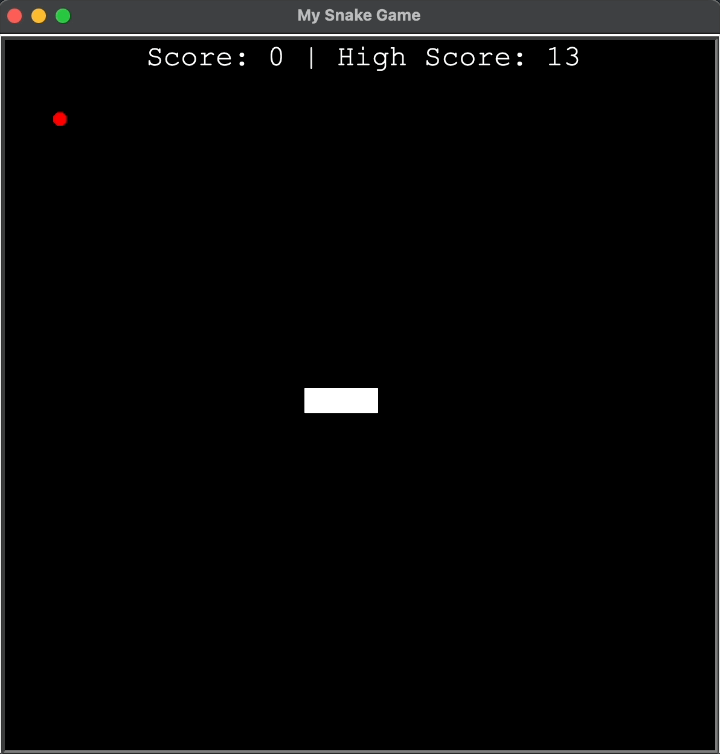

# 21 Classic Snake Game

## Overview
The **Classic Snake Game** is a Python-based recreation of the timeless arcade game, built using the `turtle` graphics library. The objective is simple: control the snake, eat food to grow, and avoid colliding with the walls or your own tail. This project focuses on clean code organization using Object-Oriented Programming (OOP) and modular design principles.

---

## Concepts Implemented
- **Object-Oriented Programming (OOP):** Classes like `Snake`, `Food`, and `Scoreboard` encapsulate game logic and promote reusability.
- **Modularization:** Code is split into multiple files (`snake.py`, `food.py`, `scoreboard.py`, `main.py`) for better organization.
- **Slicing and List Manipulation:** Efficient handling of the snake segments as a list for smooth movement and growth.
- **Class Inheritance:** The `Food` class inherits from the `Turtle` class, extending its functionality to manage food appearance and behavior dynamically.
- **Persistent High Score Tracking:** The highest score achieved is saved in `data.txt` and loaded when the game starts, ensuring it is retained across sessions.

## Game Logic Explained

### 1. Screen Setup and Snake Creation
- Initializes a game screen (600x600 pixels) with a black background.
- The snake starts with three square segments aligned horizontally.
  
### 2. Snake Movement
- The snake moves automatically in its current direction.
- Each segment follows the position of the previous one to simulate smooth movement.
- Movement is continuous and managed through a game loop with `screen.update()` and `time.sleep()` for consistent frame rates.

### 3. Controls
- Movement keys have been updated for a more natural experience:
  - `W` - Move Up
  - `S` - Move Down
  - `A` - Move Left
  - `D` - Move Right
- The snake cannot reverse directly into itself (e.g., moving from `Up` directly to `Down`).

### 4. Collision Handling & Game State Reset
- **Food Collision:** Eating food triggers the `refresh()` method, which randomly places a new food item on the screen.
- **Wall Collision:** The game no longer ends when the snake collides with a wall. Instead, a new three-segment snake respawns, and the current score resets while keeping the highest score intact.
- **Self Collision:** If the snake collides with its own body, the game resets the score and respawns a new snake.

### 5. High Score Persistence
- The game reads and writes the highest score to `data.txt`.
- If the file does not exist, it defaults to `0`.
- After each game session, if a new high score is achieved, it is saved to the file automatically.

---

## How to Run
1. Clone this repository.
2. Install dependencies:
    - Requires Python 3.x (no additional libraries needed since turtle is included in the standard library).
3. Run the game.

---

## Acknowledgments

Inspired by classic arcade games and built as part of a Python learning journey through Dr. Angela Yu’s **100 Days of Code: Python Pro Bootcamp.**

---
<section align="center">
  <code>coderBri © 2025</code>
</section>
